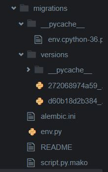

SQL - ORM

장점

- 어떤 언어든 쿼리문 바꿀 필요가 없다 - 파이선 오브젝트로 관리하기때문에 config만 바꾸면된다. DB종속성이 사라진다.


개발 순서
```bash
$ touch app.py
```


@ app.py

----

app.config['SQLALCHEMY_DATABASE_URI'] = **'sqlite:///db_flask.sqlite3'** <-- 이 부분 원하는 sqlite 경로로 바꿔준다


[flask sqlalchemy](http://flask-sqlalchemy.pocoo.org/2.3/quickstart/)

$ flask db init

-> migrations 생김


pip install flask_sqlalchemy flask_migrate


```cmd
ashleyryu:~/workspace (master) $ flask db init
/home/ubuntu/.pyenv/versions/3.6.7/lib/python3.6/site-packages/flask_sqlalchemy/__init__.py:794: FSADeprecationWarning: SQLALCHEMY_TRACK_MODIFICATIONS adds significant overhead and will be disabled by default in the future.  Set it to True or False to suppress this warning.
  'SQLALCHEMY_TRACK_MODIFICATIONS adds significant overhead and '
  Creating directory /home/ubuntu/workspace/migrations ... done
  Creating directory /home/ubuntu/workspace/migrations/versions ... done
  Generating /home/ubuntu/workspace/migrations/env.py ... done
  Generating /home/ubuntu/workspace/migrations/alembic.ini ... done
  Generating /home/ubuntu/workspace/migrations/script.py.mako ... done
  Generating /home/ubuntu/workspace/migrations/README ... done
  Please edit configuration/connection/logging settings in '/home/ubuntu/workspace/migrations/alembic.ini' before proceeding.
```


app.py 만들고

$ flask db migrate

: class 내용을 db에 반영하기 위해 준비




```cmd
ashleyryu:~/workspace (master) $ flask db migrate
/home/ubuntu/.pyenv/versions/3.6.7/lib/python3.6/site-packages/flask_sqlalchemy/__init__.py:794: FSADeprecationWarning: SQLALCHEMY_TRACK_MODIFICATIONS adds significant overhead and will be disabled by default in the futu  'SQLALCHEMY_TRACK_MO  'SQLALCH  'SQLALCHEMY_TRACK_MODIFICATIONS adds significant overhead and '
INFO  [alembic.runtime.migration] Context impl SQLiteImpl.
INFO  [alembic.runtime.migration] Will assume non-transactional DDL.
INFO  [alembic.autogenerate.compare] Detected added table 'user'
  Generating /home/ubuntu/workspace/migrations/versions/272068974a59_.py ... done
```


$ flask db upgrade

migration 파일을 실제 db에 반영


```cmd
ashleyryu:~/workspace (master) $ flask db upgrade
/home/ubuntu/.pyenv/versions/3.6.7/lib/python3.6/site-packages/flask_sqlalchemy/__init__.py:794: FSADeprecationWarning: SQLALCHEMY_TRACK_MODIFICATIONS adds significant overhead and will be disabled by default in the future.  Set it to True or False to suppress this warning.
  'SQLALCHEMY_TRACK_MODIFICATIONS adds significant overhead and '
INFO  [alembic.runtime.migration] Context impl SQLiteImpl.
INFO  [alembic.runtime.migration] Will assume non-transactional DDL.
INFO  [alembic.runtime.migration] Running upgrade  -> 272068974a59, empty message
```


$ sqlite3 db_flask.sqlite3

하면 

```sqlite
sqlite> .tables
alembic_version  user

sqlite> .schema
CREATE TABLE alembic_version (
        version_num VARCHAR(32) NOT NULL, 
        CONSTRAINT alembic_version_pkc PRIMARY KEY (version_num)
);
CREATE TABLE user (
        id INTEGER NOT NULL, 
        username VARCHAR(80) NOT NULL, 
        username VARCHAR(80) NOT NULL,         email VARCHAR(120) NOT NULL, 
        password VARCHAR(30), 
        PRIMARY KEY (id), 
        UNIQUE (email), 
        UNIQUE (username)
);
```


----

새로 해보자.

app.py 수정해서 새로운 db를 만들어보자

```python
from flask import Flask
from flask_sqlalchemy import SQLAlchemy
from flask_migrate import Migrate
import datetime

app = Flask(__name__)

app.config['SQLALCHEMY_DATABASE_URI'] = 'sqlite:///db_flask.sqlite3'
db = SQLAlchemy(app)

migrate = Migrate(app, db)

class User(db.Model):
    id = db.Column(db.Integer, primary_key=True)
    username = db.Column(db.String(80), unique=True, nullable=False) #string은 80byte, null조건 가능하지 않다
    email = db.Column(db.String(120), unique=True, nullable=False)
    created_at = db.Column(db.String(80), nullable=False)
    
    def __init__(self, username, email):
        self.username = username
        self.email = email
        self.created_at = datetime.datetime.now().strftime("%D")
    
    def __repr__(self):
        return f'{self.id} : {self.username}'
        # return '<User %r>' % self.username
```

user 추가할때 마다 생긴 시간 저장하는 db만들어놓음.

터미널에서

$ flask db init

flask db migrate

flask db upgrade

그 후, 터미널에서 user 추가해준다.

```python
ashleyryu:~/workspace (master) $ python
Python 3.6.7 (default, Jan 28 2019, 05:19:19) 
[GCC 4.8.4] on linux
Type "help", "copyright", "credits" or "license" for more information.
>>> from app import *
/home/ubuntu/.pyenv/versions/3.6.7/lib/python3.6/site-packages/flask_sqlalchemy/__init__.py:794: FSADeprecationWarning: SQLALCHEMY_TRACK_MODIFICATIONS adds significant overhead and will be disabled by default in the future.  Set it to True or False to suppress this warning.
  'SQLALCHEMY_TRACK_MODIFICATIONS adds significant overhead and '
>>> user = User('신욱', 'kang@gmail.com')
>>> user.username
'신욱'
>>> user.email
'kang@gmail.com'
>>> user.created_at
'02/07/19'
>>> db.session.add(user)
>>> db.session.commit()
>>> Kim = User('edutak', 'edutak@gmail.com')
>>> db.session.add(Kim)             
>>> db.session.commit()
>>> Ryu = User('Ashley', 'Ashley@gmail.com')   
>>> db.session.add(Ryu)                 
>>> db.session.commit()
```


```sqlite
ashleyryu:~/workspace (master) $ sqlite3 db_flask.sqlite3
SQLite version 3.8.2 2013-12-06 14:53:30
Enter ".help" for instructions
Enter SQL statements terminated with a ";"
sqlite> SELECT * FROM user;
1|신욱|kang@gmail.com|02/07/19
2|edutak|edutak@gmail.com|02/07/19
sqlite> SELECT * FROM user;
1|신욱|kang@gmail.com|02/07/19
2|edutak|edutak@gmail.com|02/07/19
3|Ashley|Ashley@gmail.com|02/07/19
```

```python
>>> users = User.query.all()
>>> users
[1 : 신욱, 2 : edutak, 3 : Ashley]
>>> type(users)
<class 'list'>
>>> users[0]
1 : 신욱
```

즉, User.query.all()을 사용해서 user를 오브젝트로써 받는다.


쿼리로 던져서 일치하는지 알아볼 땐,

```python
>>> User.query.filter_by(username='Ashley').all()
[3 : Ashley]
```


primary number로 알아볼 땐, <- 이게 더 쉽다

```python
>>> User.query.get(1)
1 : 신욱
>>> User.query.get(3)
3 : Ashley
```


user를 지울때,

```python
>>> user = User.query.get(1)
>>> user
1 : 신욱
>>> db.session.delete(user)
>>> db.session.commit()
```


지워졌는지 확인해보자.

```python
>>> users = User.query.all()
>>> users
[2 : edutak, 3 : Ashley]
```

지워졌다. 안녕 신욱씨


이 때, 두번째 사람이 username을 변경했다!

```python
>>> u1 = User.query.get(2)
>>> u1
2 : edutak
>>> u1.username = 'tak'
>>> db.session.commit()
```


변경이 되었는지 확인해보자.

```sqlite
sqlite> SELECT * FROM user;
2|tak|edutak@gmail.com|02/07/19
3|Ashley|Ashley@gmail.com|02/07/19
```

'edutak'씨가 'tak'씨로 바뀌었다!


## ORM(flask-sqlalchemy)

1. 기본설정

```bash
$ pip install flask_sqlalchemy flask_migrate
```

```python
# app.py
from flask import Flask
from flask_sqlalchemy import SQLAlchemy

app = Flask(__name__)
app.config['SQLALCHEMY_DATABASE_URI'] = 'sqlite:////tmp/test.db'
db = SQLAlchemy(app)


class User(db.Model):
    id = db.Column(db.Integer, primary_key=True)
    username = db.Column(db.String(80), unique=True, nullable=False)
    email = db.Column(db.String(120), unique=True, nullable=False)

    def __repr__(self):
        return '<User %r>' % self.username

```

2. flask db 설정

   1. 초기 설정 (`migration`폴더 생성)

      ```bash
      $ flask db init
      ```

   2. migration 파일 생성

      ```bash
      $ flask db migrate
      ```

   3. db 반영

      ```bash
      $ flask db upgrade
      ```

      

3. 활용법

   1. Create

      ```python
      # user 인스턴스 생성
      user = User(username = 'Ashley', email = 'Ash@gmail.com')
      # db.session.add명령어를 통해 추가
      # INSERT INTO user (username, email)
      # VALUES ('Ashley', 'Ash@gmail.com');과 동일한 효과다.
      db.session.add(user)
      # db에 반영
      db.session.commit()
      ```

   2.  READ

      ```python
      # SELECT * FROM user;
      users = User.query.all()
      # get 메소드는 primary key로 지정된 값을 통해 가져온다.
      user = User.query.get(1)
      # 특정 컬럼의 갑승ㄹ 가진 것을 가져오려면 다음과 같이 쓴다.
      user = User.query.filter_by(username='Ashley').all()
      user = User.query.filter_by(username='Ashley').first()
      ```

   3.  UPDATE

      ```python
      user = User.query.get(1)
      user.username = '홍길동'
      db.session.commit()
      ```

   4.  DELETE

      ```python
      user = User.query.get(1)
      db.session.delete(user)
      db.session.commit()
      ```

      

**암호화**

```bash
pip install werkzeug
```

```python
from werkzeug.security import generate_password_hash, check_password_hash

a = 'hihi'
#암호화
hash = generate_password_hash(a)
print(hash)
#차이점 확인
check_password_hash(hash, 'hihi')
check_password_hash('hihi', hash
                   )
```

